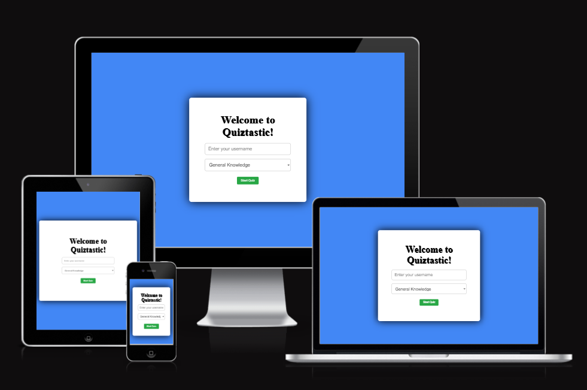

# Quiztastic 🤘🔥

**Deployed Site**: [Quiztastic](#https://github.com/Ebby88sharma/Quiztastic)

Quiztastic is a fun, interactive online quiz application designed for trivia enthusiasts across a range of subjects. Whether you're into General Knowledge, Science, History, or Geography, this quiz will put your knowledge to the test with 8-10 challenging questions in each category.

## CONTENTS

1. [User Experience](#user-experience)
2. [Design](#design)
    - [Colour Scheme](#colour-scheme)
    - [Typography](#typography)
    - [Imagery](#imagery)
    - [Wireframes](#wireframes)
3. [Features](#features)
    - [General Features](#general-features)
    - [Future Implementations](#future-implementations)
4. [Technologies Used](#technologies-used)
5. [Testing](#testing)
6. [Deployment & Local Development](#deployment-local-development)
7. [Credits](#credits)

---

## User Experience (UX)

### User Stories

- I want this website to be responsive to my device.
- I want to easily navigate the site.
- I want to test my knowledge on different subjects through a quiz.
- I want to select different categories for the quiz.
- I want to know if I selected the correct answer.
- I want to see my final score after completing the quiz.
- I want to restart the quiz once finished.

## Design

### Colour Scheme

The colours were chosen to make the interface simple yet engaging:

- **#4287F5 (blue)**: Background colour for the entire site.
- **#FFFFFF (white)**: Main container background for the quiz, input text, and general text for a clean and modern look.
- **#17A2B8 (teal)**: Button background to make answer choices visually appealing.
- **#FF0000 (red)**: Timer and incorrect answer feedback.
- **#4CAF50 (green)**: Feedback for correct answers and celebratory messages.

### Typography

Fonts were selected from **Google Fonts** to create a modern yet approachable style.

- **Raleway**: Used for headings and buttons to give a clean and professional look.
- **Sans-serif**: Applied to body text for easy readability across all screen sizes.



## Features

### General Features

- **Home Screen**: Users enter their name and select a quiz category from a dropdown menu.
- **Quiz Questions**: Each category contains 8-10 multiple-choice questions.
- **Timer**: A countdown timer for each question (20 seconds).
- **Answer Feedback**: Visual feedback is provided for correct/incorrect answers.
- **Score Tracking**: The final score is displayed at the end of the quiz.
- **Restart Option**: Users can restart the quiz at any time after viewing their final score.
- **Responsive Design**: The app works seamlessly across devices of different screen sizes.

### Future Implementations

- **Progress Bar**: Show users their progress through the quiz.
- **Leaderboard**: Track high scores across all players.
- **Difficulty Levels**: Offer multiple difficulty settings to cater to beginners and experts.
- **Save Quiz Results**: Save user quiz results for comparison over time.

---

## Technologies Used

### Languages

- **HTML5**: Structure of the website.
- **CSS3**: Styling and responsive design.
- **JavaScript**: Core logic and interactivity for the quiz.

### Libraries and Frameworks

- **Google Fonts**: For font choices (Raleway, Sans-serif).

---

## Deployment & Local Development

### Remote Deployment

The site is deployed using **GitHub Pages**.

1. In the GitHub repository, navigate to the **Settings** tab.
2. On the left-side menu, click on **Pages**.
3. From the source drop-down menu, select **main branch** and the **/root** directory.
4. GitHub Pages will generate a link to the live site.

### Local Development

#### How to Fork

1. Log into GitHub.
2. Navigate to the [Quiztastic repository](#https://github.com/Ebby88sharma/Quiztastic).
3. Click the **Fork** button at the top right of the page.
4. A new page will open where you can edit the repository name. Click **Create Fork**.

#### How to Clone

1. Log into GitHub.
2. Navigate to the [Quiztastic repository](#).
3. Click the **Code** button and copy the HTTPS/SSH link.
4. Open the terminal in your preferred IDE, change the directory, and type:
   ```bash
   git clone <repository_link>

### Acknowledgments
I would like to thank my Code Institute mentor, Can for his support and insightful feedbacks.