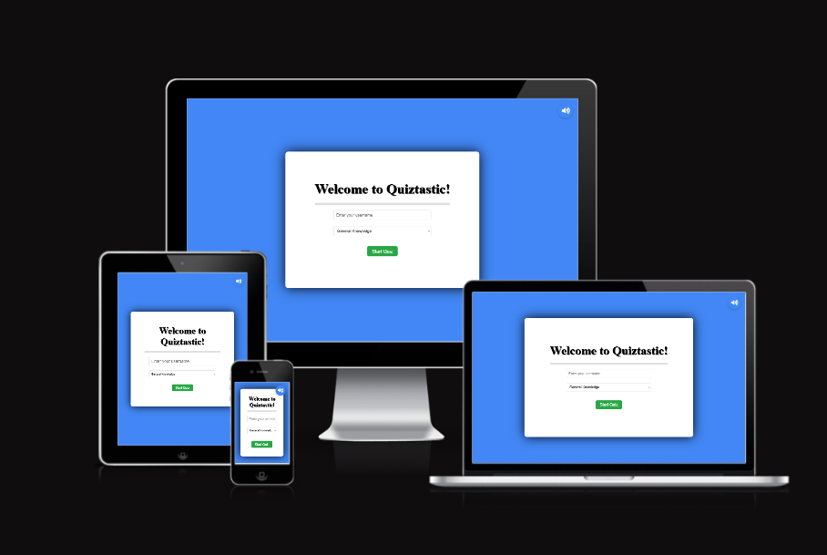
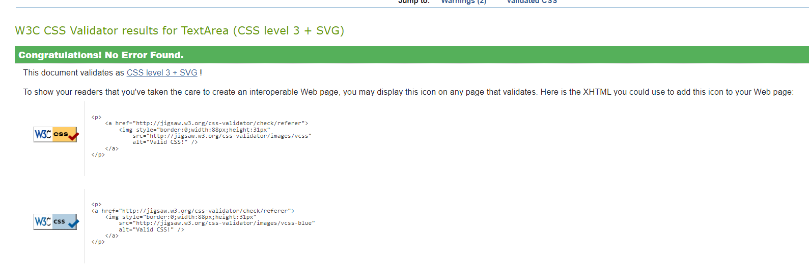

# Quiztastic 🤘🔥

**Deployed Site**: [Quiztastic](https://ebby88sharma.github.io/Quiztastic/)



Quiztastic is a fun, interactive online quiz application designed for trivia enthusiasts across a range of subjects. Whether you're into General Knowledge, Science, History, or Geography, this quiz will put your knowledge to the test with 8-10 challenging questions in each category.

---

## CONTENTS

1. [User Experience](#user-experience)
2. [Design](#design)
    - [Colour Scheme](#colour-scheme)
    - [Typography](#typography)
3. [Features](#features)
    - [General Features](#general-features)
    - [Future Implementations](#future-implementations)
4. [Technologies Used](#technologies-used)
5. [Testing](#testing)
6. [Learning Outcomes](#learning-outcomes)
7. [Deployment & Local Development](#deployment-local-development)
8. [Credits](#credits)

---

## User Experience (UX)

### User Stories

- As a new user, I want to enter my name and choose a quiz category so that I feel personally involved in the quiz experience.
- As a trivia lover, I want a variety of categories (General Knowledge, Science, History, Sports, Geography) so that I can choose a quiz topic that interests me.
- As a player, I want the quiz to show me one question at a time with four answer options so that I can focus on answering each question without distraction.
- As a competitive user, I want to receive immediate feedback when I select an answer so that I know if my choice was correct or incorrect.
- As a user, I want to hear sound effects when I select an answer so that the quiz feels more engaging.
- As a user, I want a countdown timer for each question so that the quiz feels more exciting and I stay focused on answering within the time limit.
- As a user, I want to be able to track my progress visually (e.g., via a progress bar) so that I know how far I am through the quiz.
- As a user, I want a score summary at the end of the quiz so that I can see how many questions I answered correctly.
- As a high-performer, I want celebratory feedback (sound and animation) if I score well so that I feel accomplished.
- As a user who didn't perform well, I want motivational feedback (sound and text) if I don’t score well so that I feel encouraged to try again.
- As a user, I want the ability to restart the quiz after viewing my score so that I can play again without reloading the page.
- As a user, I want a seamless experience when selecting answers, where the quiz moves to the next question automatically, so that there is no disruption in the flow of the game.
- As a mobile user, I want the quiz to be responsive across different devices so that I can play it on my phone, tablet, or desktop without layout issues.
- As a player, I want questions to be randomized within each quiz category so that I can have a different experience every time I play.
- As a returning user, I want the quiz to load quickly and be easy to understand so that I can start playing without unnecessary delays.

## Design

### Colour Scheme

The colours were chosen to make the interface simple yet engaging:

- **#4287F5 (blue)**: Background colour for the entire site.
- **#FFFFFF (white)**: Main container background for the quiz, input text, and general text for a clean and modern look.
- **#17A2B8 (teal)**: Button background to make answer choices visually appealing.
- **#FF0000 (red)**: Timer and incorrect answer feedback.
- **#4CAF50 (green)**: Feedback for correct answers and celebratory messages.

### Typography

Fonts were selected from **Google Fonts** to create a modern yet approachable style.

- **Raleway**: Used for headings and buttons to give a clean and professional look.
- **Sans-serif**: Applied to body text for easy readability across all screen sizes.


---

## Features

### General Features

- **Home Screen**: Users enter their name and select a quiz category from a dropdown menu.
- **Quiz Questions**: Each category contains 8-10 multiple-choice questions.
- **Timer**: A countdown timer for each question (20 seconds).
- **Answer Feedback**: Visual feedback is provided for correct/incorrect answers.
- **Score Tracking**: The final score is displayed at the end of the quiz.
- **Restart Option**: Users can restart the quiz at any time after viewing their final score.
- **Responsive Design**: The app works seamlessly across devices of different screen sizes.

### Future Implementations

- **Leaderboard**: Track high scores across all players.
- **Difficulty Levels**: Offer multiple difficulty settings to cater to beginners and experts.
- **Save Quiz Results**: Save user quiz results for comparison over time.

---

## Technologies Used

### Languages

- **HTML5**: Structure of the website.
- **CSS3**: Styling and responsive design.
- **JavaScript**: Core logic and interactivity for the quiz.

### Libraries and Frameworks

- **Google Fonts**: For font choices (Raleway, Sans-serif).
- **pixabay**: For sound effects (click sound, cheering sound, sad sound).
- **Font-awesome**: Used for sound icon and project icon.

---

## Testing

### W3c HTML Validator 
### JigSaw CSS Validator 
### JSlint JS Validator 

### Manual Testing

The following aspects of the quiz were manually tested:

- **Quiz Start**: The quiz starts properly after entering a username and selecting a category.
- **Question Navigation**: Questions load one after the other, and the "Next Question" button works as expected.
- **Answer Selection**: Selecting an answer gives visual feedback for correct/incorrect answers, and the score updates correctly.
- **Score Calculation**: The final score is correctly calculated based on the number of correct answers.
- **Sound Control**: The mute/unmute functionality works, and the sound icon changes to reflect the sound state.
- **Timer**: The countdown timer works, and the quiz moves to the next question when time runs out.
- **Toast Messages**: Toast notifications display when the username is missing, time runs out, or no questions are available.
- **Quiz Restart**: Restarting the quiz resets the questions, score, and timer, allowing the game to be replayed.


  
---

## Learning Outcomes

Through building **Quiztastic**, several key front-end skills were reinforced:

1. **DOM Manipulation**: Dynamically updating HTML elements based on user interactions such as displaying questions and handling results.
2. **Event Handling**: Handling user inputs and clicks efficiently to enhance interactivity.
3. **Fetch API**: Loading question data from an external JSON file.
4. **Responsive Design**: Ensuring compatibility across different screen sizes.
5. **CSS Animations & Transitions**: Creating hover effects and visual feedback for buttons and toast messages.
6. **Sound Control**: Implementing sound feedback with mute/unmute functionality for better user experience.
7. **Progress Tracking**: Using a progress bar and score tracking for real-time user feedback.
8. **User Feedback Mechanisms**: Providing motivational messages and sound effects based on user performance.

---

## Deployment & Local Development

### Remote Deployment

The site is deployed using **GitHub Pages**.

1. In the GitHub repository, navigate to the **Settings** tab.
2. On the left-side menu, click on **Pages**.
3. From the source drop-down menu, select **main branch** and the **/root** directory.
4. GitHub Pages will generate a link to the live site.

### Local Development

#### How to Fork

1. Log into GitHub.
2. Navigate to the [Quiztastic repository](#https://github.com/Ebby88sharma/Quiztastic).
3. Click the **Fork** button at the top right of the page.
4. A new page will open where you can edit the repository name. Click **Create Fork**.

#### How to Clone

1. Log into GitHub.
2. Navigate to the [Quiztastic repository](#https://github.com/Ebby88sharma/Quiztastic).
3. Click the **Code** button and copy the HTTPS/SSH link.
4. Open the terminal in your preferred IDE, change the directory, and type:
   ```bash
   git clone <https://github.com/Ebby88sharma/Quiztastic>

### Acknowledgments
I would like to thank my Code Institute mentor, Can for his support and insightful feedbacks.
